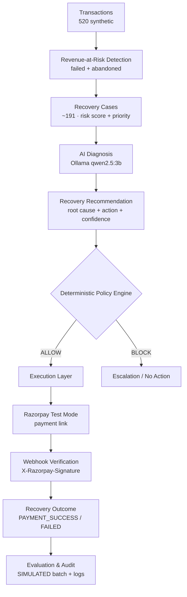

# RecoverAI
### Find the money you're losing. Recover what you can. Escalate what you can't.

> AI-powered revenue recovery controller — built for the **Razorpay AI Buildathon 2026 · AI Revenue Recovery** track.

RecoverAI is a revenue recovery system that turns ambiguous payment failures into measurable outcomes. It detects revenue at risk from transactions, diagnoses *why* a payment failed or was abandoned, recommends a bounded recovery action, enforces deterministic safety policy, executes only approved financial actions in **Razorpay Test Mode**, verifies the outcome via webhook, and produces a **simulated but fully deterministic evaluation** over 520 synthetic transactions.

**Track:** AI Revenue Recovery · **Mode:** Synthetic demo (no real merchant data, no real money, Test Mode only)

| | |
|---|---|
| **GitHub** | `https://github.com/princitripathi/recover-ai` |
| **Demo Video** | `[5-minute pitch video URL]` |
| **Live Demo** | `Local development only` |

     

---

## 1. The problem

Businesses lose revenue *after* the payment form — not because a product failed, but because the money never settled.

- Failed payments (bank downtime, network errors, do-not-honor)
- Insufficient funds / limit breaches that are temporary
- Abandoned checkouts that never reached authorization
- Retries that silently exceed safe limits
- High-risk cases that should be escalated, not auto-retried

Most systems stop at `status = failed`. RecoverAI asks the next four questions:

> **Why** did it fail? **Should** we recover it? **What** is the safest recovery action? **Can we prove** the money came back?

---

## 2. The solution

RecoverAI implements the full revenue-recovery loop — not a chatbot, not a blind retry script:

```
Detect → Diagnose → Decide → Enforce → Execute → Verify → Measure
```

| Stage | Ownership | Why it exists |
|---|---|---|
| **Detect** | Deterministic risk engine | Revenue at risk must be objective and auditable, not LLM-guessed |
| **Diagnose** | Local LLM (Ollama) | Human-like root-cause reasoning across failure modes |
| **Recommend** | LLM + controlled vocabulary | Bounded suggestions (`SEND_PAYMENT_LINK`, `RETRY_PAYMENT`, …) |
| **Decide** | Deterministic policy engine | Safety gate — the LLM never controls money |
| **Execute** | Razorpay Test Mode payment links (only when `ALLOW`) | Real API surface without real funds |
| **Verify** | Razorpay webhook `payment.captured` / `payment.failed` (HMAC) | Only verified payment success counts as revenue recovered |
| **Measure** | Simulated deterministic evaluation (520 txns) | Repeatable numbers without calling Razorpay 520 times |
| **Record** | Recovery actions + webhook events + audit logs | Every decision stays in the database |

Every dashboard number is rendered from the database — nothing is hardcoded.

---

## 3. Why this fits the Razorpay AI Revenue Recovery track

| Track requirement | RecoverAI implementation | Verified in code |
|---|---|---|
| Revenue at risk | `SUM(amount) WHERE status IN (failed, abandoned)` · `dashboard_service.py` | `src: services/dashboard_service.py:12-13` |
| Intervention selection | AI diagnosis → `root_cause` + `recommended_action` + `confidence` + `explanation` | `services/diagnosis_service.py:28-53` |
| Bounded recovery | Controlled vocabularies (6 root causes, 5 actions); Pydantic validation | `schemas/diagnosis.py` |
| Decision enforcement | Deterministic policy (`ALLOW`/`BLOCK`) with explicit rules | `services/policy_service.py:153-316` |
| Execution | `SEND_PAYMENT_LINK` via Razorpay Test Mode REST (`httpx`, no SDK) — only if `ALLOW` | `services/execution_service.py:185-299`, `services/razorpay_service.py:34-127` |
| Outcome verification | `POST /api/webhooks/razorpay` HMAC-SHA256, event-id dedup, `payment.captured` → `PAYMENT_SUCCESS` + verified paise amount | `services/webhook_service.py:18-32` |
| Measurement | `POST /api/evaluation/run` simulated over 520 synthetic transactions, persisted | `services/evaluation_service.py:11-230` |
| Stopping / escalation | `ESCALATE` / `NO_ACTION` always `ALLOW`; HIGH-risk and over-limit actions are `BLOCKED`; `payment.failed` never increments revenue | `services/policy_service.py:303-316`, `services/webhook_service.py:280-310` |

---

## 4. Product workflow



**What each stage does — in one line:**

1. **Transactions** — seeded from `recover-ai/data/demo_transactions.csv`; 520 realistic rows with `retry_count`, `hours_since_event`, etc.
2. **Risk Detection** — `risk_service.calculate_risk` (0-100, 5 weighted factors) → `HIGH`/`MEDIUM`/`LOW` + `recovery_priority` 0-1.
3. **Recovery Cases** — one per `failed`/`abandoned`; persisted with risk factors.
4. **AI Diagnosis** — `POST /api/recovery-cases/{id}/diagnose` calls Ollama locally, constrained to controlled vocab, validated by Pydantic.
5. **Policy Engine** — `POST /api/recovery-cases/{id}/policy-check` runs pure rules; returns `ALLOW`/`BLOCK` + `rules_evaluated`.
6. **Execution** — `POST /api/recovery-cases/{id}/execute` — policy is the gate; only `SEND_PAYMENT_LINK` calls Razorpay (`razorpay_service.create_payment_link`).
7. **Verification** — Razorpay posts `payment.captured` / `payment.failed` to `POST /api/webhooks/razorpay`; HMAC verified, `event_id` deduped, outcome applied idempotently.
8. **Evaluation** — `POST /api/evaluation/run` simulates the same pipeline (no LLM, no Razorpay) and persists to `evaluation_runs`.

---

## 5. The most important design decision: AI ≠ Authority

> **The LLM recommends. The policy engine decides.**

This is a financial system. Hallucinated or high-confidence-but-wrong model output must never move money.

**How safety is enforced (all verified in `app/config.py` and `services/policy_service.py`):**

| Constraint | Value | Effect |
|---|---|---|
| Risk gating | `HIGH` (80-100) → BLOCK for financial actions | No auto-retries on risky customers |
| Amount limit | `RETRY_PAYMENT` ≤ **₹25,000**; `SEND_PAYMENT_LINK` ≤ **₹50,000** | High tickets go to human review |
| Confidence gate | `min_ai_confidence` = **0.6** (financial actions) | Low-confidence suggestions are rejected |
| Retry gate | `max_retry_count` = **2** | Repeated failures don't spin forever |
| Eligibility | `recovery_cases.status = pending_review` only | Recovered / already-processed cases can't be re-charged |
| Vocab gate | Diagnosis must be in allowed sets; invalid → safe default / `BLOCK` | No invented actions escape validation |
| Unsupported → safe | `RETRY_PAYMENT` execution not wired; `CONTACT_CUSTOMER`/`ESCALATE`/`NO_ACTION` never call Razorpay | Graceful `EXECUTION_FAILED` / non-payment paths |

**Example that actually happens in the product:**

```
AI says:   "RETRY_PAYMENT  confidence 0.82  (temporary bank downtime)"

Policy:    transaction_status == failed ✓
           retry_count 3 >= 2           ✗  → BLOCK
           detail: "Retry count 3 exceeds maximum 2"

Result:    { status: "BLOCKED", razorpay_called: false }
           Razorpay is never contacted. Audit log preserved.
```

---

## 6. AI Diagnosis

- **Runtime:** local **Ollama** (`RECOVERAI_OLLAMA_URL` default `http://127.0.0.1:11434`)
- **Model:** `qwen2.5:3b` (`RECOVERAI_OLLAMA_MODEL`, timeout `RECOVERAI_LLM_TIMEOUT=30s`) — see `app/config.py:16-19`
- **Prompt:** structured instruction + transaction/risk context only (no secrets, no keys) — `services/diagnosis_service.py:28-54`
- **Output:** `DiagnosisResult` (`root_cause`, `recommended_action`, `confidence 0-1`, `reason`, `risk_factors`) validated by Pydantic
- **Controlled vocabularies:**
  - Root causes: `TEMPORARY_PAYMENT_FAILURE` · `INSUFFICIENT_FUNDS` · `BANK_DECLINE` · `CUSTOMER_ABANDONMENT` · `UNKNOWN_FAILURE` · `HIGH_RISK_TRANSACTION`
  - Actions: `RETRY_PAYMENT` · `SEND_PAYMENT_LINK` · `CONTACT_CUSTOMER` · `ESCALATE` · `NO_ACTION`
- **Resilience:** if Ollama is down → `diagnosis_status = ai_unavailable` (HTTP 200 with error), parse error → `parse_error`; caller never crashes; frontend shows retryable state.

> Local LLM means no customer PII leaves the machine and no cloud per-token cost during the buildathon.

---

## 7. Recovery policy engine

Pure, deterministic, auditable. No LLM, no HTTP. Located at `services/policy_service.py` and exercised by `tests/test_policy.py` (30+ cases).

**Rules per action (all must pass for `ALLOW`):**

| Action | Checks |
|---|---|
| `RETRY_PAYMENT` | `status == failed` · `retry_count < 2` · `risk != HIGH` · `amount ≤ 25,000` · `confidence ≥ 0.6` · eligible |
| `SEND_PAYMENT_LINK` | `status ∈ {failed, abandoned}` · `amount ≤ 50,000` · `risk != HIGH` · eligible |
| `CONTACT_CUSTOMER` | `status ∈ {failed, abandoned}` · eligible |
| `ESCALATE` | always `ALLOW` |
| `NO_ACTION` | always `ALLOW` |

No diagnosis → `BLOCK` (`diagnosis_status != completed`). `HIGH` always blocks automated finance. Each response includes `policy_version` (currently `1.0.0`), `reason`, and `rules_evaluated[]` (`rule`, `passed`, `detail`) for the audit trail.

---

## 8. Razorpay integration

**Test Mode only.** No real money is ever moved — payment links open the Razorpay test checkout.

| Item | Detail | Code |
|---|---|---|
| Auth | `Basic base64(key_id:key_secret)` via `httpx` | `services/razorpay_service.py:19-31` |
| API | `POST {base}/payment_links` — builds `amount` in **paise**, `currency`, `customer.name`, `description`, `reference_id`, `notify` | `services/razorpay_service.py:34-98` |
| Guard | `has_credentials()` + policy `ALLOW` required; `BLOCK` → `razorpay_called = false` | `services/execution_service.py:159-134` |
| Actions wired | `SEND_PAYMENT_LINK` (live); `RETRY_PAYMENT`/`CONTACT_CUSTOMER` return `EXECUTION_FAILED` / non-Razorpay path | `services/execution_service.py:185-214` |
| Idempotency | `case_id + action` uniqueness — second success-type attempt returns `BLOCKED duplicate` | `services/execution_service.py:67-83` |
| Lifecycle | `BLOCKED` · `EXECUTION_FAILED` · `LINK_CREATED` · `PAYMENT_PENDING` · `PAYMENT_SUCCESS` · `PAYMENT_FAILED` | `database.py:62-65`, `schemas/execution.py:4-11` |
| **Money rule** | `LINK_CREATED ≠ revenue recovered`. Only a verified webhook may increase `amount_recovered`. | `services/execution_service.py:13`, `services/webhook_service.py:198-276` |

**Environment (placeholders only — never commit real keys):**

```bash
RAZORPAY_KEY_ID=rzp_test_xxxxxxxxxxxxxx
RAZORPAY_KEY_SECRET=xxxxxxxxxxxxxxxxxxxxxxxx
RAZORPAY_BASE_URL=https://api.razorpay.com/v1
RAZORPAY_WEBHOOK_SECRET=whsec_xxxxxxxxxxxxxxxxxxxxxxxx
# With the RECOVERAI_ prefix also accepted:
# RECOVERAI_RAZORPAY_KEY_ID / RECOVERAI_RAZORPAY_KEY_SECRET / RECOVERAI_RAZORPAY_WEBHOOK_SECRET
```

Allowed origins for the preview: `http://localhost:4000`, `http://127.0.0.1:4000` (`app/config.py:9-14`).

### Webhook verification

`POST /api/webhooks/razorpay` (`routes/webhooks.py:10`) reads the **raw body bytes**, computes `HMAC-SHA256(raw_body, RAZORPAY_WEBHOOK_SECRET)` and compares with `X-Razorpay-Signature` via `hmac.compare_digest` (`services/webhook_service.py:18-32`).

- Missing header → `400 {error: "missing_signature"}`
- Mismatch → `400 {error: "invalid_signature"}`
- Empty `RAZORPAY_WEBHOOK_SECRET` → rejected (untrusted)
- Secrets never appear in responses or logs
- Next.js proxy (`src/app/api/[...path]/route.ts`) preserves the raw body and forwards `X-Razorpay-Signature`

**Idempotency & verification guarantees:**

- `webhook_events.event_id` is `UNIQUE`; duplicate delivery returns `200 {status: "duplicate"}` without re-applying.
- Only `payment.captured` / `payment.failed` are acted on; unknown types → `ignored`; unknown references → `failed` — both persisted.
- `payment.captured` → `LINK_CREATED`/`PAYMENT_PENDING` → `PAYMENT_SUCCESS` + `amount_recovered = payment.amount/100` (verified paise, not original order amount) + `transactions.status = paid` + `audit_logs`.
- `payment.failed` → `PAYMENT_FAILED`, `amount_recovered` stays `0.00`.
- Second `payment.captured` for an already `PAYMENT_SUCCESS` action is deduped — no double count.

---

## 9. Evaluation / Results

> **SIMULATED EVALUATION — not real recovered money.** The 520 transactions are synthetic; the numbers below come from a deterministic simulation that replays the pipeline without calling Razorpay or Ollama. Verified revenue is tracked separately under "Revenue Recovered (Verified)".

**How to run:**

```bash
curl -X POST http://127.0.0.1:8000/api/evaluation/run
curl http://127.0.0.1:8000/api/evaluation/latest   # also available via the dashboard button
```

**Latest verified run — fresh DB, `commit 0.6.0` (produced by `services/evaluation_service.py:run_evaluation`):**

| Metric | Value |
|---|---|
| Dataset | **520** transactions (`recover-ai/data/demo_transactions.csv`) |
| Total revenue | **₹4,429,765.10** |
| Revenue at risk | **₹1,371,221.08** (failed + abandoned) |
| Recovery cases | **191** · eligible **191** |
| Policy | **188** ALLOW · **3** BLOCK |
| Recovery attempts | **95** (`ALLOW` ∧ `SEND_PAYMENT_LINK`/`RETRY_PAYMENT`) |
| Successful (sim.) | **55** |
| Failed (sim.) | **40** |
| **Simulated amount recovered** | **₹422,956.32** |
| **Recovery rate** | **30.85%** = `422956.32 / 1371221.08` |
| Case recovery rate | **28.8%** = `55 / 191` |
| Baseline (simulated) | **₹0.00** — *"No automated recovery"* |

**Method (from `recover-ai/docs/evaluation.md:26-55`):**

For each of the 191 cases (ordered by `case_id`):
1. **Diagnosis simulation** (no LLM): deterministic `failure_reason → (root_cause, action, confidence)` table (temporary → 0.85, insufficient funds → 0.72, etc.).
2. **Policy simulation**: re-applies the exact rules from `policy_service` (amount / risk / retry / confidence).
3. **Outcome simulation**: `roll = SHA256(case_id) % 100`; threshold `55/65/72` based on `recovery_priority`; `roll < threshold` → `PAYMENT_SUCCESS` (→ add `amount` to `amount_recovered`).
4. No `recovery_cases`/`transactions` rows are mutated — only `evaluation_runs` is written.

**Formulas:**

```
recovery_rate      = amount_recovered / revenue_at_risk   (0 if denominator 0)
case_recovery_rate = successful_recoveries / eligible_cases
```

Both rate numerators/denominators are real aggregates or deterministic simulation — not invented.

**Simulated vs. verified — the dashboard keeps them separate:**

| Verified path | Simulated path |
|---|---|
| `POST /api/recovery-cases/{id}/execute` → live Razorpay `payment_links` | `POST /api/evaluation/run` → in-process simulation |
| `payment.captured` webhook → `amount_recovered` in `recovery_cases` | Hash outcome → `amount_recovered` in `evaluation_runs` |
| Shown as **Revenue Recovered (Verified)** | Shown as **Revenue Recovered (Simulated)** under **SIMULATED BATCH EVALUATION** |

---

## 10. Dashboard / product experience

Next.js App Router (`src/app/page.tsx:618-900`) — responsive, no external screenshots needed; every value is API-sourced.

| Surface | What it shows | Verified |
|---|---|---|
| KPI cards | **Revenue at Risk** (failed/abandoned counts) · **High Risk Revenue** · **Revenue Recovered (Verified)** · **Recovery Rate** · HIGH/MEDIUM/LOW distribution | `getSummary()` + `getRiskSummary()` |
| Revenue Overview | Large number + failed/abandoned stacked bar | `dashboard/summary` aggregates |
| Architecture Boundaries | 6-point explanation (risk deterministic, policy gate, Test Mode …) | Static copy |
| Recovery Cases table | `Case / Transaction` · customer · `₹ amount` · status badge · risk bar (0-100) · level · priority (0-100%) · failure reason · date — sortable/filterable | `getRecoveryCases()` (joined with transactions) |
| Transaction Detail (sticky) | Full txn + deterministic risk (score/level/priority/factors) + chain: **AI Diagnosis → Policy → Execution → Outcome** | Per-case APIs |
| AI Diagnosis | `Run AI Diagnosis` → root cause · action badge · confidence % · explanation · factors · `AI_UNAVAILABLE`/`PARSE_ERROR` retry | `runDiagnosis` / `getDiagnosis` |
| Policy Check | `Run Policy Check` → decision badge (`ALLOW`/`BLOCK`) · reason · `rules_evaluated[]` with ✓/✗ · blocked notice | `runPolicyCheck` / `getPolicyDecision` |
| Recovery Execution | `Execute Recovery` (only `SEND_PAYMENT_LINK` + `ALLOW`) → status · Razorpay reference · payment link · `LINK_CREATED = not yet recovered` warning · history list | `executeRecoveryAction` / `getExecutionHistory` |
| Outcome | `Amount Recovered` (₹, with "only verified success" helper) · `PAYMENT_SUCCESS`/`PAYMENT_FAILED`/`PAYMENT_PENDING`/`BLOCKED` · audit chain explanation | `executionHistory` + `recovery_cases.amount_recovered` |
| **Evaluation card** | **SIMULATED BATCH EVALUATION** — revenue-at-risk vs recovered (sim.), recovery rate, case rate, cases processed, policy allowed/blocked, attempts, baseline, formulas, distinct-ness disclaimer | `POST /api/evaluation/run` / `GET /api/evaluation/latest` |
| Button | **Run Batch Evaluation** (loading + error states) | Frontend state |

No images are hardcoded in this README — add screenshots to `recover-ai/docs/` and reference them when available.

---

## 11. Tech stack

| Layer | Technology | Purpose |
|---|---|---|
| Frontend | Next.js 16.3.3 (App Router, Turbopack) + React 19.2.8 + TypeScript 5 | Merchant dashboard in buildathon preview (`src/app/page.tsx`) |
| UI | Tailwind CSS 4 + shadcn/ui (Radix) + lucide-react + Framer Motion | Design system, cards, badges, tables |
| Backend | FastAPI 0.116.1 + Pydantic + Uvicorn | REST API (`recover-ai/backend/app/main.py:15`) |
| DB | SQLite (`sqlite:///`) with service layer + migrations + CSV seeding | `recover-ai/backend/app/database.py` (transactions, recovery_cases, policy_decisions, recovery_actions, webhook_events, evaluation_runs, audit_logs) |
| AI | Ollama (`qwen2.5:3b`, `RECOVERAI_OLLAMA_*`) via `httpx` | Diagnosis service (prompt → JSON → Pydantic) |
| Payments | Razorpay Test Mode REST (`httpx`, no SDK) + HMAC webhook | Payment links + verification |
| Data | `demo_transactions.csv` (520) + `generate_data.py` | Synthetic, deterministic risk seeding |
| Testing | pytest 8.4.1 + FastAPI TestClient | 170 tests (see below) |
| Tooling | bun (frontend), `eslint`/`eslint-config-next`, `tailwindcss`, `tw-animate-css` | Dev/Bundling |

No other stack is claimed.

---

## 12. Architecture — services and responsibilities

```
Transaction
  → Risk (score/level/priority)         risk_service.py         deterministic, no LLM
    → AI Diagnosis (root cause/action)  diagnosis_service.py    Ollama qwen2.5:3b, Pydantic, ai_unavailable fallback
      → Policy (ALLOW/BLOCK)            policy_service.py       pure rules, 5 actions, persisted
        → Execution (→ Razorpay)        execution_service.py    gatekeeps, httpx, idempotency, audit
          → Razorpay HTTP               razorpay_service.py     Basic auth, payment_links
          → Webhook (outcome)           webhook_service.py      HMAC, event_id dedup, state machine, amount
          → Evaluation (simulated)      evaluation_service.py   520-run deterministic simulation, metrics
```

| Service (`recover-ai/backend/app/services/*.py`) | Responsibility | Calls |
|---|---|---|
| `risk_service.py` | Weighted risk (status 0-35, amount 0-20, failure 0-20, history 0-16, recency 0-10) → 0-100 · level · factors · priority 0-1 | No LLM, no network |
| `diagnosis_service.py` | Build prompt from transaction+risk → call Ollama → parse/validate → persist to `recovery_cases` | Ollama only |
| `policy_service.py` | Load case+diagnosis → evaluate action-specific rules → persist `policy_decisions` | Nothing external |
| `razorpay_service.py` | Create Razorpay payment links (`amount_paise`, `currency`, `reference_id`, `notify`) | Razorpay API |
| `execution_service.py` | Verify `ALLOW` + credential + action match → call Razorpay → persist `recovery_actions` | Policy gate → Razorpay |
| `webhook_service.py` | `verify_signature` → parse `payment.captured`/`payment.failed` → lookup `recovery_actions` → transition + `amount_recovered` + txn + `audit_logs` | Signature check |
| `evaluation_service.py` | Simulated diagnosis/policy/hash outcome over all 520 rows → metrics → `evaluation_runs` | Nothing external |
| `transaction_service.py` / `recovery_service.py` / `dashboard_service.py` | Read-only queries + aggregates | DB only |

Routes (`recover-ai/backend/app/routes/*.py`): `health`, `transactions`, `recovery_cases`, `dashboard`, `risk`, `diagnosis`, `policy`, `execution`, `webhooks`, `evaluation` — see API table below.

---

## 13. Project structure

```text
recover-ai/                          # git root (Windows dev env)
  src/app/page.tsx                   # Next.js merchant dashboard (Diagnosis → Policy → Execution → Outcome + Evaluation)
  src/services/recoverai-api.ts      # Isolated fetch client (health, transactions, risk, diagnosis, policy, execution, webhooks, evaluation)
  src/app/api/[...path]/route.ts     # Proxy GET/POST/PUT/PATCH/DELETE → FastAPI; preserves raw body + X-Razorpay-Signature
  src/components/recoverai/          # KpiCard, StatusBadge, States
  proxy.ts / next.config.ts / tailwind.config.ts

  recover-ai/                        # FastAPI project
    backend/
      app/
        main.py                      # 0.6.0 · CORS · lifespan init_db
        config.py                    # RECOVERAI_ settings (Ollama, policy, Razorpay, webhook)
        database.py                  # SCHEMA_SQL + _migrate_schema + seed_demo_data (520)
        models/                      # Frozen dataclasses
        schemas/                     # Pydantic: transaction, recovery_case, diagnosis, policy, execution, dashboard
        routes/                      # 10 routers (see below)
        services/                    # 10 services (see above)
      tests/
        test_api.py · test_risk.py · test_diagnosis.py · test_policy.py
        test_execution.py · test_webhook.py · test_evaluation.py
        conftest.py                  # sqlite://./test_recoverai.db fixture
      requirements.txt               # fastapi, uvicorn, pydantic-settings, pytest, httpx (only 5 deps)
    data/
      demo_transactions.csv          # 520 synthetic transactions
      generate_data.py
    docs/
      architecture.md
      evaluation.md
    README.md
    .env.example
    .gitignore
```

Generated artefacts omitted: `.next`, `node_modules`, `__pycache__`, `.venv`, `*.db`.

---

## 14. API / backend endpoints

All routes are served under `/api` and reachable via the Next.js proxy at `/api/...` in the preview.

| Method | Endpoint | Purpose | Source |
|---|---|---|---|
| GET | `/api/health` | Service + mode | `routes/health.py` |
| GET | `/api/transactions` | List all transactions | `routes/transactions.py` |
| GET | `/api/transactions/{id}` | Transaction detail | `routes/transactions.py` |
| GET | `/api/recovery-cases` | Recovery cases (joined with risk + txn) | `routes/recovery_cases.py` |
| GET | `/api/dashboard/summary` | `total_revenue`, `revenue_at_risk`, `revenue_recovered` (verified), `recovery_rate` | `routes/dashboard.py` |
| GET | `/api/risk/cases` | Filter/sort by `risk_level`, `sort_by`, `order` | `routes/risk.py` |
| GET | `/api/risk/cases/{id}` | Single case with risk assessment | `routes/risk.py` |
| GET | `/api/risk/summary` | Counts + revenue by HIGH/MEDIUM/LOW | `routes/risk.py` |
| POST | `/api/recovery-cases/{id}/diagnose` | Call Ollama, validate, persist | `routes/diagnosis.py` |
| GET | `/api/recovery-cases/{id}/diagnosis` | Stored diagnosis or 404 | `routes/diagnosis.py` |
| POST | `/api/recovery-cases/{id}/policy-check` | Deterministic `ALLOW`/`BLOCK` + `rules_evaluated` | `routes/policy.py` |
| GET | `/api/recovery-cases/{id}/policy` | Latest policy decision or 404 | `routes/policy.py` |
| POST | `/api/recovery-cases/{id}/execute` | Gate → Razorpay `payment_links` (`SEND_PAYMENT_LINK` only) | `routes/execution.py` |
| GET | `/api/recovery-cases/{id}/actions` | Execution history for the case | `routes/execution.py` |
| POST | `/api/webhooks/razorpay` | HMAC-verify, idempotent, apply `payment.captured`/`payment.failed` | `routes/webhooks.py:10` |
| GET | `/api/webhooks/events` | Last 100 webhook events (audit) | `routes/webhooks.py:28` |
| POST | `/api/evaluation/run` | Deterministic simulated run (SIMULATED, persisted) | `routes/evaluation.py:8` |
| GET | `/api/evaluation/latest` | Latest `evaluation_runs` row | `routes/evaluation.py:28` |

No other endpoints are claimed.

---

## 15. Safety & security

- **Env-only secrets** — `RAZORPAY_KEY_ID`/`RAZORPAY_KEY_SECRET`/`RAZORPAY_WEBHOOK_SECRET` via `pydantic-settings` (`env_prefix=RECOVERAI_`, `env_file=.env`); never hardcoded, never logged, never in API responses (asserted in `tests/test_execution.py:363-389`).
- **`.env` ignored** — `.gitignore` at both levels excludes `.env`, `.env*.local`, `.venv`, `*.db`, `__pycache__` (verified `C:\...\ .gitignore:41`).
- **Test Mode** — all Razorpay calls target `https://api.razorpay.com/v1` (configurable) with test credentials; no real settlement.
- **Policy gate** — the only call site for Razorpay is behind `policy_decision == ALLOW` + credential check; `BLOCK` → `razorpay_called = false` (verified in execution tests).
- **Webhook HMAC** — SHA256 over raw body + `hmac.compare_digest`; missing/invalid → `400`; empty `RAZORPAY_WEBHOOK_SECRET` → rejected.
- **Idempotency** — `webhook_events.event_id UNIQUE` (delivery dedup) + `recovery_actions` `PAYMENT_SUCCESS` guard (no double increment of `amount_recovered`).
- **Bounded actions** — only `SEND_PAYMENT_LINK` is wired; `RETRY_PAYMENT` execution returns `EXECUTION_FAILED`; `ESCALATE`/`NO_ACTION` are always `ALLOW` with no financial call.
- **Auditability** — `recovery_actions`, `policy_decisions`, `webhook_events`, `audit_logs` persist every transition; decisions are never overwritten; the UI's **Outcome** section explains Diagnosis → Policy → Execution → Outcome + Amount.

---

## 16. Testing

**170 tests passing** (`python -m pytest`, `recover-ai/backend`). No mocks leak to production — all Razorpay/Ollama calls are patched.

| Area | File | What is exercised |
|---|---|---|
| Health / transactions / dashboard | `tests/test_api.py` | Aggregates, at-risk joins, empty-DB handling |
| Risk scoring | `tests/test_risk.py` | 5-factor weights, clamping, level, priority, CSV edge cases (~30 cases) |
| AI diagnosis | `tests/test_diagnosis.py` | Prompt building, parsing (incl. markdown fence), Ollama success, `AI_UNAVAILABLE`, `PARSE_ERROR`, vocab fallback |
| Policy engine | `tests/test_policy.py` | All 5 actions, amount/retry/risk/confidence/eligible rules, persistence, determinism, "never calls Ollama/Razorpay" |
| Razorpay execution | `tests/test_execution.py` | `LINK_CREATED`, policy gate, missing/mismatched policy, credentials, API error/timeout, duplicate prevention, audit, secret non-leak, amount-not-recovered invariant |
| Webhooks & outcomes | `tests/test_webhook.py` | Valid/invalid/missing signature, no-secret rejection, duplicate + double-count guards, `payment.failed`, unknown type/reference, `PAYMENT_SUCCESS` updates action/txn/amount, paise-true amount, event persistence, audit, state-machine invariants |
| Evaluation | `tests/test_evaluation.py` | Dataset 520, revenue-at-risk equality, recovery-rate formulas, policy counts, determinism (`run→run` equal), no Razorpay calls, `evaluation_runs` persistence, simulated-not-verified isolation |

Also: `bunx tsc --noEmit` (typecheck) and `bun run build` (Next.js build) both pass.

---

## 17. How to run locally (Windows friendly)

**Prerequisites:** Python 3.12+, Node 20+ / bun, git. Ollama is optional for AI diagnosis — the app degrades gracefully to `AI_UNAVAILABLE`.

### Backend (FastAPI, port 8000)

```bash
cd recover-ai/backend
python -m venv .venv
.venv\Scripts\activate        # Windows
# source .venv/bin/activate  # macOS / Linux
pip install -r requirements.txt

# optional: set env (Test Mode placeholders)
# copy ..\..\.env.example .env  # then edit RECOVERAI_RAZORPAY_* and RECOVERAI_OLLAMA_* as needed

uvicorn app.main:app --reload --port 8000
# health: http://127.0.0.1:8000/api/health
```

### Frontend (Next.js, port 4000 — already running in the sandbox)

```bash
# from the git root (recover-ai/)
bun install
bun run dev --port 4000
# or preview against a remote API:
# set RECOVERAI_API_BASE_URL=http://127.0.0.1:8000 in the frontend env / Vercel settings
```

### Ollama (optional, for live AI diagnosis)

```bash
ollama serve &
ollama pull qwen2.5:3b
# verify:
curl http://127.0.0.1:11434/api/tags
```

If Ollama is off, `POST /api/recovery-cases/{id}/diagnose` returns `ai_unavailable` — the policy engine will then `BLOCK`, and the UI shows a retry CTA. No crash, no hang.

### Seed / data

The database is auto-created on first `init_db()` (`lifespan` + `seed_demo_data`). To re-seed:

```bash
# from recover-ai/backend
Remove-Item -Force recoverai.db, test_recoverai.db -ErrorAction SilentlyContinue
uvicorn app.main:app --reload --port 8000   # re-creates 520 rows at startup
```

---

## 18. Environment variables

No `.env` is committed. Create `recover-ai/backend/.env` from `.env.example` and fill **Test Mode** placeholders:

```bash
# Database / data
RECOVERAI_DATABASE_URL=sqlite:///./recoverai.db
RECOVERAI_DEMO_DATA_PATH=../data/demo_transactions.csv
RECOVERAI_CORS_ORIGINS=["http://localhost:4000"]

# LLM
RECOVERAI_OLLAMA_URL=http://127.0.0.1:11434
RECOVERAI_OLLAMA_MODEL=qwen2.5:3b
RECOVERAI_LLM_TIMEOUT=30

# Policy
RECOVERAI_MAX_RETRY_AMOUNT=25000.0
RECOVERAI_MAX_PAYMENT_LINK_AMOUNT=50000.0
RECOVERAI_MIN_AI_CONFIDENCE=0.6
RECOVERAI_MAX_RETRY_COUNT=2

# Razorpay Test Mode (use Razorpay Dashboard → Test Mode → API Keys)
RAZORPAY_KEY_ID=rzp_test_xxxxxxxxxxxxxx
RAZORPAY_KEY_SECRET=xxxxxxxxxxxxxxxxxxxxxxxx
RAZORPAY_BASE_URL=https://api.razorpay.com/v1
RAZORPAY_WEBHOOK_SECRET=whsec_xxxxxxxxxxxxxxxxxxxxxxxx
# or prefixed equivalents: RECOVERAI_RAZORPAY_KEY_ID / RECOVERAI_RAZORPAY_KEY_SECRET / RECOVERAI_RAZORPAY_WEBHOOK_SECRET
```

> **Never commit `.env`.** The example file documents placeholders only. CI uses the same variable names with repo secrets.

---

## 19. Demo (judge path — 2 minutes)

1. Open `http://localhost:4000` — **Revenue at Risk** + risk distribution load from the FastAPI backend.
2. Pick a **MEDIUM**-risk recovery case → **Deterministic Risk Assessment** (score, level, priority, factors).
3. **Run AI Diagnosis** → root cause (`BANK_DECLINE`, …) + recommended action badge + confidence + explanation.
4. **Run Policy Check** → `ALLOW`/`BLOCK` + `rules_evaluated` list. Show a **BLOCKED** case: `HIGH` risk or `amount > 50,000`.
5. For an **ALLOWED** `SEND_PAYMENT_LINK` case → **Execute Recovery** → payment link + reference + history. Point out: `LINK_CREATED` is *not* recovered.
6. Demonstrate **Outcome**: fire a local webhook (or show the test that does) — `payment.captured` → `PAYMENT_SUCCESS`, `amount_recovered` increases by verified paise amount; `payment.failed` → `PAYMENT_FAILED` (unchanged). Duplicate delivery → no double count.
7. Click **Run Batch Evaluation** → Evaluation card populates — call out **SIMULATED** label, formulas, baseline `₹0`, and that real verified recovery (Test Mode) and simulated batch are two different numbers.

---

## 20. What broke / engineering challenges

| Challenge | Why it mattered | How it was solved | Result |
|---|---|---|---|
| **LLM recommendations must never drive money** | A hallucinated `RETRY_PAYMENT` on a ₹80,000 HIGH-risk case would be a safety failure | A real `policy_service` gate *in front* of `razorpay_service` — AI output is Pydantic-validated and then discarded unless `ALLOW`; `BLOCK` never reaches Razorpay; tests assert `razorpay_called == false` on `BLOCK` | Financial control is code, not prompt |
| **Ollama output is unstructured** | Free-form JSON with markdown fences / drifted keys broke parsers | Strict prompt + fence stripping + JSON parse + controlled-vocab fallback (`UNKNOWN_FAILURE`/`NO_ACTION`) + confidence clamping; `AI_UNAVAILABLE`/`PARSE_ERROR` status states in the API | Diagnosis degrades, it never crashes |
| **Ollama may be down** | Buildathon machines won't always have the model running | `httpx.Client(timeout=30)` with catch-all → store `ai_unavailable` and return `200 {diagnosis_status: ai_unavailable}`; policy then deterministically `BLOCK`s | Frontend shows retry CTA, pipeline keeps working |
| **Preventing live Razorpay spam in evaluation** | Batched evaluation over 520 rows would create hundreds of payment links and rate-limit/billing risk | `evaluation_service` runs a *simulated* pipeline (rule-based diagnosis/policy, stable hash outcome) and persists only to `evaluation_runs`; `razorpay_service` is never imported by evaluation | `POST /api/evaluation/run` works with empty credentials and is deterministic (`run→run` equal) |
| **Webhook verification and idempotency** | An unverified webhook would let an attacker fabricate `PAYMENT_SUCCESS` and inflate `amount_recovered` | `verify_signature` over raw bytes + `event_id UNIQUE` + `PAYMENT_SUCCESS` guard + verified `amount` from `payment.amount` (paise) as source of truth | Tests cover valid/invalid/missing sig, duplicate, double-count guards, unknown type/reference |
| **Supporting all 5 actions without half-finished finance** | Wiring `RETRY_PAYMENT` to Razorpay Orders API would expand scope and risk | Only `SEND_PAYMENT_LINK` calls Razorpay; other `ALLOW`-ed actions return non-financial statuses (`ESCALATE`/`NO_ACTION` are safe, `RETRY_PAYMENT` returns `EXECUTION_FAILED {not supported}`) — documented and tested | Judges see the full loop without a fake implementation |
| **Keeping dashboard numbers honest** | Hardcoded cards would ace a demo and fail a review | Every metric is a SQL aggregate or a deterministic simulation; dashboard fetches `summary`/`risk/summary`/`evaluation/latest` on load; `amount_recovered` only grows via verified webhooks | No invented percentages — formulas are in `docs/evaluation.md:81-91` |

---

## 21. Limitations

These are explicit — the codebase documents and tests them — and they make the project honest.

- **Simulated evaluation, not real money.** `POST /api/evaluation/run` never calls Razorpay. `₹422,956.32` is a simulation; real recovery goes through `payment.captured` webhooks into `revenue_recovered (verified)`.
- **Local AI dependency.** `qwen2.5:3b` via Ollama must be running locally. When absent, diagnosis is `AI_UNAVAILABLE` → policy `BLOCK`; no fallback LLM is configured.
- **Only one live Razorpay action.** `SEND_PAYMENT_LINK` is wired. `RETRY_PAYMENT` exists in simulation and as an always-`ALLOW`/`BLOCK` diagnosis outcome but returns `EXECUTION_FAILED (not supported)` in live execution.
- **No auth / multi-tenancy.** `recover-ai/backend` is a single-tenant synthetic demo. SQLite + single `transactions` table; no JWT, no RBAC.
- **Deterministic heuristics are not production policy.** The evaluation's `SHA256(case_id) % 100` success threshold is a repeatability device, not a statistical model of real payment success rates.
- **No background job queue for retries.** Retry/ESCALATE are policy outcomes, not scheduled jobs.

---

## 22. Future roadmap

Clearly **future work** — none of this is claimed as implemented:

- More Recovery Channels — WhatsApp/SMS/email nurture flows alongside payment links; configurable per merchant.
- Razorpay Orders + Auto-Retry — wire `RETRY_PAYMENT` to Razorpay Orders / Smart Retry with idempotency windows.
- Adaptive Policies — policy thresholds learned from historical success, not just static config.
- Larger, Merchant-Tuned Evaluation — stratified synthetic datasets (UPI vs cards vs netbanking, cohort-based) + closed-loop A/B harness.
- Multi-tenant SaaS — JWT/org isolation, merchant-key-scoped Razorpay credentials, Postgres.
- Observability — structured logs, traces per `case_id`, webhook delivery metrics, Prometheus.
- Human Escalation Workflows — `ESCALATE` → queue + SLA + agent notes + resolution audit.

---

## 23. Why RecoverAI matters

RecoverAI is not trying to replace financial controls with AI.

**It uses AI where AI is useful** — understanding context (bank downtime vs. insufficient funds vs. abandonment) and recommending the *next best recovery step*.

**It uses deterministic systems where money is involved** — policy thresholds, amount/risk gates, confidence gates, retry caps, execution idempotency, HMAC-verified webhooks, and a persisted audit trail.

That split is the point. The LLM is inside the controller, not in control of the money.

---

## 24. Buildathon submission

| Field | Value |
|---|---|
| Project | **RecoverAI** |
| Track | **AI Revenue Recovery — Razorpay AI Buildathon 2026** |
| Tagline | *Find the money you're losing. Recover what you can. Escalate what you can't.* |
| GitHub | `https://github.com/princitripathi/recover-ai` |
| Demo Video | `[5-minute pitch video URL — unlisted YouTube / Loom]` |
| Demo Login | None (synthetic demo, no auth) |
| Docs | `recover-ai/docs/architecture.md` · `recover-ai/docs/evaluation.md` |

Replace the bracket placeholders before submission. No real secrets are in this README.

---

## 25. License

No `LICENSE` file is committed at the repository root today (`recover-ai/` or git root). To make the submission open-source, add one — MIT is the conventional choice for buildathons:

```bash
# at the git root
npx mit-license  # or copy https://choosealicense.com/licenses/mit/
```

Until a license is added, all rights are technically reserved to the authors. Adding a license before making the GitHub repo public is recommended prior to judging.

---

## 26. Appendix — running the checks yourself

```bash
# from recover-ai/backend
pip install -r requirements.txt
python -m pytest           # ~170 tests collected, expect 170 passed
python -m pytest --collect-only -q   # verify collection count

# from the git root
bunx tsc --noEmit          # typecheck — expect 0 errors
bun run build              # Next.js Turbopack — expect "Compiled successfully"
```
